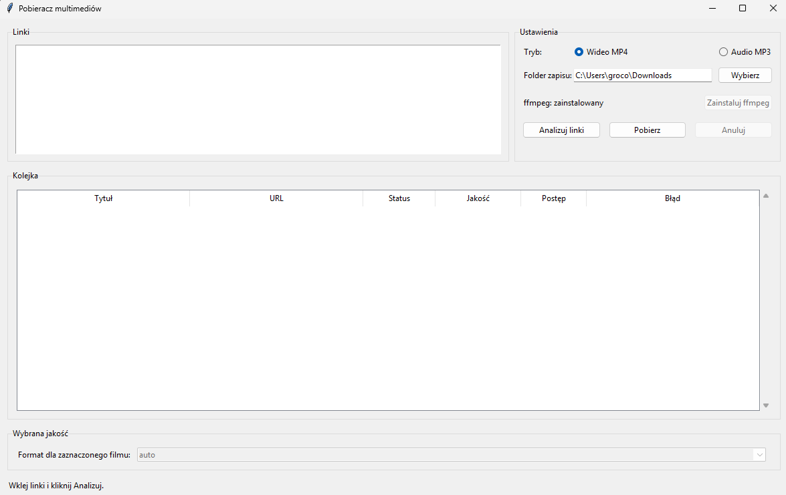

# Pobieracz wideo i audio


Desktopowa aplikacja w Pythonie do analizowania i pobierania wielu linkow naraz z uzyciem `yt-dlp`.



## Pobieranie

Najprostszym sposobem uruchomienia aplikacji jest pobranie gotowej wersji z sekcji **Releases** na GitHubie.

Dostępne pliki:

- **Windows** – `Pobieracz-yt-dlp-windows.exe`  
  Wystarczy pobrać plik i uruchomić aplikację.

- **Linux** – `Pobieracz-yt-dlp-linux.tar.gz`  
  Pobierz archiwum, rozpakuj je i uruchom aplikację z katalogu projektu.

Wszystkie wersje programu znajdziesz tutaj:  
https://github.com/szigma/Pobieracz-yt-dlp/releases

## Wydania

Od wersji `v1.0.1` projekt ma dwa osobne artefakty releasu:

- `Pobieracz-yt-dlp-windows.exe` dla Windows,
- `Pobieracz-yt-dlp-linux.tar.gz` dla Linux.

## Funkcje

- wklejanie wielu linkow, po jednym w linii,
- analiza linkow przed pobraniem,
- wybor folderu docelowego,
- tryb `MP4` albo `MP3`,
- domyslny wybor najlepszej jakosci,
- reczna zmiana jakosci dla wybranego filmu,
- kolejkowanie pobran wykonywanych po kolei,
- automatyczne numerowanie plikow przy konflikcie nazw,
- osobna obsluga bledow dla kazdego linku,
- informacja, kiedy wybrana jakosc wymaga `ffmpeg`,
- wskaznik statusu `ffmpeg` w aplikacji,
- przycisk automatycznej instalacji `ffmpeg` na Windows.

## Wymagania

- Python 3.11 lub nowszy,
- `ffmpeg` w `PATH`, jesli chcesz eksportowac do `MP3` albo laczyc osobne strumienie obrazu i dzwieku.

## Instalacja

1. Sklonuj repozytorium albo pobierz kod z GitHuba.
2. Przejdz do katalogu projektu.
3. Utworz i aktywuj wirtualne srodowisko.
4. Zainstaluj zaleznosci.

### Windows PowerShell

```powershell
python -m venv .venv
.venv\Scripts\Activate.ps1
pip install -r requirements.txt
```

### macOS / Linux

```bash
python3 -m venv .venv
source .venv/bin/activate
pip install -r requirements.txt
```

## Uruchomienie z kodu

### Windows PowerShell

```powershell
python -m downloader_app
```

### macOS / Linux

```bash
python3 -m downloader_app
```

## Uruchomienie gotowej aplikacji na Windows

Jesli korzystasz z gotowego wydania, pobierz `Pobieracz-yt-dlp-windows.exe` z sekcji Releases i uruchom plik bez instalowania Pythona.

## Uruchomienie gotowej paczki na Linux

Pobierz `Pobieracz-yt-dlp-linux.tar.gz` z sekcji Releases, rozpakuj archiwum i uruchom aplikacje z katalogu projektu.

```bash
tar -xzf Pobieracz-yt-dlp-linux.tar.gz
cd Pobieracz-yt-dlp
python3 -m venv .venv
source .venv/bin/activate
pip install -r requirements.txt
python -m downloader_app
```

## ffmpeg w aplikacji

Aplikacja sprawdza przy starcie, czy `ffmpeg` jest dostepny.

- jesli `ffmpeg` jest zainstalowany, zobaczysz status `ffmpeg: zainstalowany`,
- jesli go brakuje, zobaczysz status `ffmpeg: brak`,
- na Windows pojawi sie przycisk `Zainstaluj ffmpeg`, ktory probuje wykonac instalacje przez `winget`.

Po udanej instalacji status w aplikacji odswieza sie bez restartu programu.

## Instalacja ffmpeg

`ffmpeg` jest potrzebny do:

- eksportu do `MP3`,
- laczenia osobnych strumieni obrazu i dzwieku przy czesci filmow.

### Windows

Najprosciej przez `winget`:

```powershell
winget install Gyan.FFmpeg.Essentials
```

Po instalacji uruchom ponownie terminal i sprawdz:

```powershell
ffmpeg -version
```

### macOS

Przez Homebrew:

```bash
brew install ffmpeg
```

Sprawdzenie:

```bash
ffmpeg -version
```

### Linux

Ubuntu / Debian:

```bash
sudo apt update
sudo apt install ffmpeg
```

Fedora:

```bash
sudo dnf install ffmpeg
```

Arch Linux:

```bash
sudo pacman -S ffmpeg
```

Sprawdzenie:

```bash
ffmpeg -version
```

Na Linux `ffmpeg` jest wymagany do poprawnego dzwieku dla trybu `Auto` i recznego wyboru jakosci, jesli serwis rozdziela obraz i dzwiek.

## Testy

### Windows PowerShell

```powershell
python -m unittest discover -s tests
```

### macOS / Linux

```bash
python3 -m unittest discover -s tests
```

## Uwagi

- Niektore serwisy moga wymagac `ffmpeg`, nawet przy pobieraniu wideo.
- Jesli plik o tej samej nazwie juz istnieje, aplikacja zapisze nowy plik z dopiskiem ` (1)`, ` (2)` itd.
- Na Linux aplikacja ma priorytetowo wybierac formaty z dzwiekiem; jesli wybrana jakosc nie da sie zapisac z audio, downloader powinien zejsc do bezpiecznego wariantu z dzwiekiem zamiast zapisywac sam obraz.

## Third-party software

This project uses the following open-source software:

### yt-dlp
- Repository: https://github.com/yt-dlp/yt-dlp  
- License: The Unlicense (public domain)

yt-dlp is a powerful command-line program used to download videos and audio from many websites.

## Disclaimer

This project is intended for educational purposes and for downloading
content you have permission to download.

Users are responsible for complying with the terms of service of the
websites they use.
